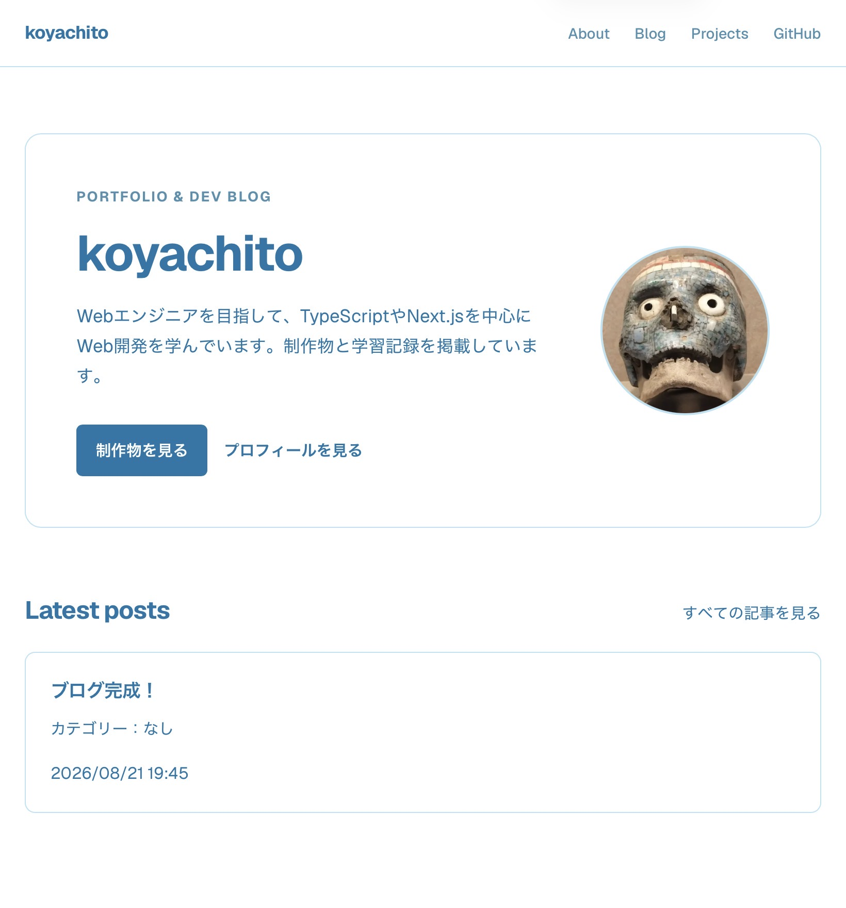

# koya-blog

Next.jsとPostgreSQLで構築した、個人ブログ兼ポートフォリオサイトです。

TypeScriptとCRUDの学習を目的として、記事管理、Google OAuthによる認証・認可、Markdown表示、カテゴリー・タグ管理などを実装しました。

## URL

- Webサイト: https://koyachito.com
- GitHub: https://github.com/koyachito/koya-blog

管理画面は登録された管理者アカウントのみ利用できます。

## Screenshot



## 主な機能

### 公開画面

- ポートフォリオ用トップページ
- プロフィールページ
- 制作物紹介ページ
- 公開済み記事の一覧・詳細表示
- Markdown形式の記事表示
- カテゴリー・タグの表示
- 作成日時・更新日時の表示
- レスポンシブデザイン
- 下書き記事へのアクセス制限

### 管理画面

- Google OAuthによるログイン
- メールアドレスによる管理者認可
- 記事の作成・編集・削除
- 記事の公開・下書き切り替え
- カテゴリーの作成・一覧・名前変更・削除
- タグの作成・一覧・名前変更・削除
- 記事へのカテゴリー・複数タグの設定・変更・解除
- 使用中のカテゴリー・タグの削除制限
- Zodによる入力値の検証
- 入力エラーのインライン表示

## 技術スタック

| 分類 | 技術 |
|---|---|
| Language | TypeScript |
| Framework | Next.js 16（App Router） |
| UI | React 19 |
| Authentication | Auth.js / Google OAuth |
| Database | PostgreSQL 16 |
| ORM | Prisma 7 |
| Markdown | react-markdown / remark-gfm / rehype-slug |
| Validation | Zod |
| Local environment | Docker / Docker Compose |
| Hosting | Vercel |
| Production database | Neon |
| Domain / DNS | Cloudflare |

## 設計・実装上のポイント

### Server ComponentsとServer Actions

記事やカテゴリーなどのデータ取得にはServer Componentsを使用しています。

フォーム送信やデータ更新にはServer Actionsを使用し、クライアントから独自APIを直接呼び出さずに、サーバー側の処理を実行する構成にしました。

### 認証と認可

Auth.jsとGoogle OAuthを使用してログイン機能を実装しています。

ログイン済みかどうかだけでなく、環境変数`ADMIN_EMAIL`とログインユーザーのメールアドレスを照合し、管理者以外が管理画面や更新処理を利用できないようにしています。

### カテゴリーとタグ

記事とカテゴリーは多対一、記事とタグは多対多の関係として設計しています。

Prismaの`connect`、`set`、`disconnect`を使い、記事作成・編集時の関連付けと解除を実装しました。

使用中のカテゴリーやタグは削除できないようにし、記事との関連が壊れないようにしています。

### Markdown

記事本文はMarkdown形式でデータベースに保存します。

表示時に`react-markdown`でReactコンポーネントへ変換し、`remark-gfm`で表や取り消し線などのGitHub Flavored Markdownに対応しています。

Markdown内のHTMLは解釈しない構成にしています。

### 公開状態の管理

記事には公開・下書きの状態を持たせています。

一般ユーザー向けの取得処理では公開済み記事だけを検索条件に含め、下書き記事のIDを直接指定しても閲覧できないようにしています。

## AIの利用について

開発では、ChatGPTやCodexを調査、実装補助、コードレビューに利用しました。

提示されたコードをそのまま採用するのではなく、公式ドキュメントやWebでも調査し、一行ずつ役割と動作を理解してから使用しました。

要件定義、仕様の選択、実装範囲の管理、動作確認、デプロイの判断は自分で行い、2026年8月12日から8月22日までの期間で本番公開まで完了しました。

## デプロイ構成

| 用途 | サービス |
|---|---|
| Next.js | Vercel |
| PostgreSQL | Neon（Singapore） |
| DNS・独自ドメイン | Cloudflare |
| OAuth | Google Cloud |
| Serverless Functions | Vercel Functions（Singapore） |

## ローカル開発

```bash
git clone https://github.com/koyachito/koya-blog.git
cd koya-blog
npm install
cp .env.example .env
docker compose up -d
npx prisma migrate dev
npm run dev
```

`.env`には、データベース接続情報、Google OAuth、Auth.js、管理者メールアドレスの設定が必要です。

詳細は[開発環境構築手順](docs/setup.md)を参照してください。

## ドキュメント

- [要件定義](docs/requirements.md)
- [開発環境構築手順](docs/setup.md)
- [開発ログ](docs/devlog.md)

## Author

[koyachito](https://github.com/koyachito)